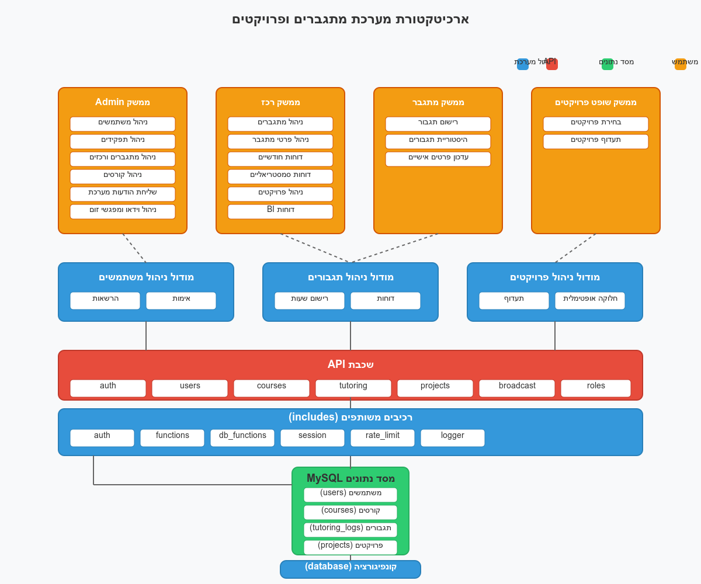

# מערכת ניהול מתגברים ופרויקטים

## סקירה כללית

מערכת מקיפה לניהול מערך מתגברים, שופטים ופרויקטים במסגרת אקדמית. המערכת מאפשרת ניהול יעיל של תגבורים אקדמיים, חלוקת פרויקטים לשופטים, ומעקב מלא אחר הביצועים - הכל בממשק ידידותי למשתמש בעברית.



## תכונות עיקריות

### ניהול משתמשים ותפקידים

- מערכת הרשאות מדורגת: מנהל, רכז, מתגבר, אורח
- ניהול משתמשים, סיסמאות ואיפוס חשבונות
- ניהול תפקידים מותאם אישית

### ניהול תגבורים

- רישום תגבורים על ידי מתגברים
- רישום שעות, תלמידים וקורסים
- היסטוריית תגבורים למתגבר
- דוחות לרכזים (חודשיים וסמסטריאליים)
- דוחות BI לניתוח מתקדם

### ניהול פרויקטים ושופטים

- מערכת תעדוף פרויקטים חכמה לשופטים
- חלוקה אופטימלית של פרויקטים לשופטים
- ייבוא ויצוא נתונים (CSV, אקסל)
- מעקב אחר בחירות שופטים

### מערכת הודעות

- שליחת הודעות שידור (broadcast) לקבוצות משתמשים
- תזמון פגישות זום
- ניהול פרופיל משתמש

## דרישות מערכת

### שרת

- PHP 7.4 ומעלה
- MySQL 5.7 ומעלה
- הרשאות כתיבה לתיקיות המערכת

### דפדפנים נתמכים

- Chrome, Firefox, Safari, Edge (גרסאות עדכניות)
- תמיכה מלאה בעברית ו-RTL

## התקנה

### 1. הורדת הקבצים

העתק את כל קבצי המערכת לשרת שלך.

### 2. הגדרת מסד נתונים

1. צור מסד נתונים MySQL חדש
2. יבא את מבנה מסד הנתונים מהקובץ `rag/SQL`
3. עדכן את פרטי החיבור למסד הנתונים בקובץ `config/database.php`:

```php
define('DB_SERVER', 'localhost');
define('DB_USERNAME', 'username');
define('DB_PASSWORD', 'password');
define('DB_NAME', 'database_name');
```

### 3. הגדרת שם האתר

עדכן את שם האתר בקובץ `config/database.php`:

```php
define('SITE_NAME', 'שם האתר שלך');
```

### 4. הרשאות קבצים

ודא כי התיקיות הבאות הן בעלות הרשאות כתיבה (777 או 755):

- `/uploads` (אם קיימת)
- `/logs` (אם קיימת)

### 5. יצירת משתמש מנהל

צור משתמש מנהל ראשון באמצעות דף ההרשמה ואז שנה את התפקיד שלו ל-'admin' דרך גישה ישירה למסד הנתונים.

## מבנה תיקיות

```
/
├── ajax/             # קבצי AJAX לתקשורת אסינכרונית
├── api/              # נקודות קצה API
├── assets/           # קבצים סטטיים (CSS, JS, תמונות)
├── config/           # קבצי הגדרות
├── includes/         # קבצי PHP משותפים
├── pages/            # דפי האתר
│   ├── admin/        # דפי מנהל מערכת
├── templates/        # תבניות משותפות
└── index.php         # דף הבית
```

## תפקידים והרשאות

### מנהל (admin)

- גישה מלאה למערכת
- ניהול משתמשים ותפקידים
- ניהול קורסים
- שליחת הודעות מערכת

### רכז (coordinator)

- ניהול מתגברים המשויכים אליו
- ניהול פרויקטים ושופטים
- צפייה בדוחות תגבור
- קידום משתמשים מאורחים למתגברים

### מתגבר (mentor)

- רישום תגבורים
- צפייה בהיסטוריית תגבורים אישית
- עדכון פרטים אישיים

### אורח (guest)

- צפייה מוגבלת
- אפשרות לשדרוג על ידי רכז

## נקודות API מרכזיות

המערכת כוללת נקודות קצה API לפעולות הבאות:

- אימות משתמשים (`/api/auth.php`)
- ניהול קורסים (`/api/courses.php`)
- ניהול משתמשים (`/api/users.php`)
- ניהול תפקידים (`/api/roles.php`)
- רישום תגבורים (`/api/tutoring.php`)
- שליחת הודעות מערכת (`/api/broadcast.php`)

## פרויקטים

### בחירת פרויקטים

המערכת מאפשרת לשופטים לבחור פרויקטים לפי סדר עדיפות. התהליך:

1. שופט נכנס למערכת דרך הדף `/pages/project_selection.php`
2. השופט מזין את האימייל שלו לזיהוי
3. בוחר פרויקטים לפי סדר עדיפות
4. המערכת שומרת את ההעדפות

### חלוקת פרויקטים

רכזים יכולים לבצע חלוקה אופטימלית של פרויקטים בין השופטים:

1. קביעת פרמטרים (כמות פרויקטים לשופט, כמות שופטים לפרויקט)
2. חלוקה אוטומטית לפי עדיפויות
3. ייצוא החלוקה לקובץ CSV

## אבטחה

המערכת כוללת מספר אמצעי אבטחה:

- שימוש ב-CSRF Tokens לכל הטפסים
- סניטציה של קלט משתמש
- הגנה מפני SQL Injection
- הצפנת סיסמאות בעזרת כיווני (one-way hashing)
- ניהול סשן מאובטח

## תחזוקה

### גיבוי

מומלץ לגבות באופן שוטף:

- קבצי המערכת
- מסד הנתונים

### עדכונים

המערכת עשויה להתעדכן מעת לעת. עקוב אחר הוראות העדכון הספציפיות.

## טיפול בבעיות נפוצות

### שגיאת חיבור למסד נתונים

1. ודא שפרטי החיבור בקובץ `config/database.php` נכונים
2. בדוק שמסד הנתונים פעיל ונגיש

### תצוגת עברית שבורה

1. ודא שהקידוד מוגדר כ-UTF-8
2. בדוק שכל הקבצים נשמרו בקידוד UTF-8

### בעיות הרשאות

אם מופיעות שגיאות גישה לקבצים, ודא שהרשאות התיקיות והקבצים מוגדרות כראוי.

## טכנולוגיות

המערכת מבוססת על הטכנולוגיות הבאות:

- PHP (שפת צד שרת)
- MySQL (מסד נתונים)
- JavaScript (צד לקוח)
- AJAX (תקשורת אסינכרונית)
- CSS (עיצוב)

## פיתוח

המערכת פותחה על ידי דורון הוסט.

קוד המערכת הוא קוד פתוח לטובת פרויקטים מבורכים כמו הפרויקט של סמי שמעון לתגבור מילואמניקים

העם ישראל חי
